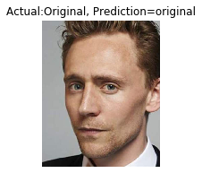
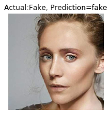
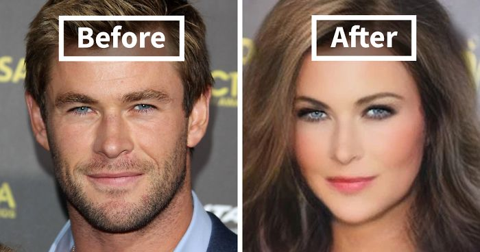
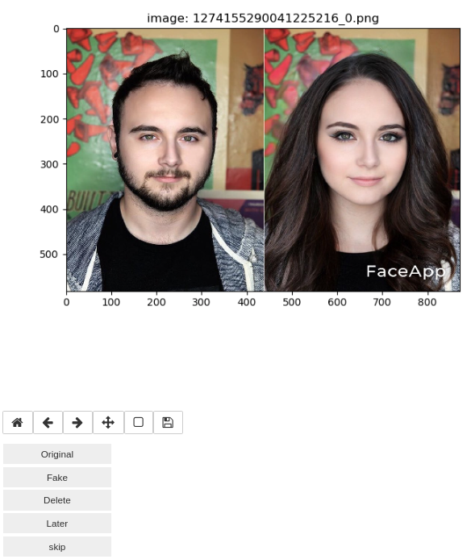
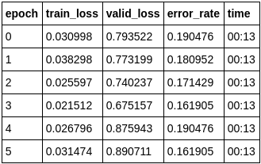
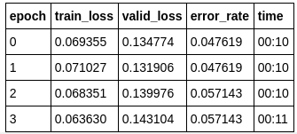
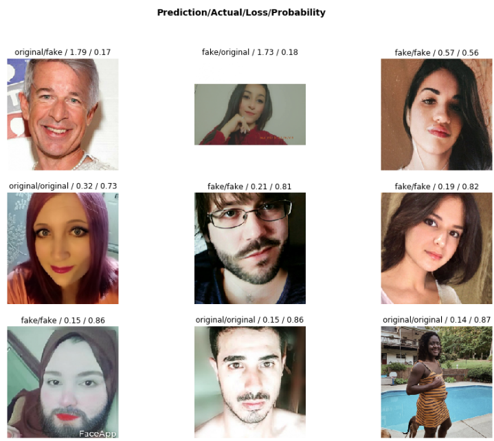
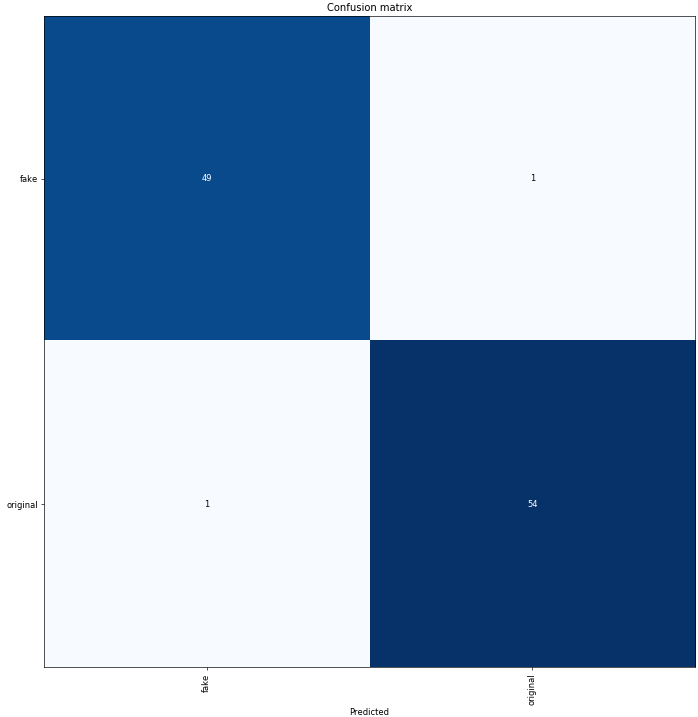

# FACEAPP gender swap fake detection

In this project we used Deep Learning to detect fake images generated by FaceApp app gender swap feature.

|         Actual         |          Fake          |
| :--------------------: | :--------------------: |
|  |  |

## Overview 

FACEAPP is a famous app that uses Deep Learning to generate fake pictures of people with different styles of hair, makeup and so on. But in this project we are interested in its gender swap feature which as its name indicates turns images of males into females and vice versa. 

## Goal

The goal is to scrap a decent amount of fake and original images, clean the images and train a deep learning model using transfer learning and FASTAI to achieve a good accuracy.

## Table of content

- [Requirements](#Requirements)
- [Scrapping Data](#Scrapping)
- [Cleaning Data](#Cleaning)
- [Training the Model](#Training)

## Requirements

- Python 3.x
- Matplotlib

### Scrapping & Cleaning

- Tweepy: for scrapping twitter data
- OpenCV: for cropping the images and creating new images
- shutil: for moving files
- Jupyter notebooks widgets:  for easier data cleaning

### Training

- [FASTAI](https://github.com/fastai/course-v3)

## Scrapping Data

### Tweets(Images) at `#faceapp`

- Scrapped images in the tweets of this hashtag as most people that uses the application either talks about it or uses the hashtag when uploading their generated pictures.
- Images were saved in a folder called `data` so that we can clean it later.

### Tweets(Images) at `#new_avatar`

- After cleaning the data, I found that the data was not balanced. So I downloaded some images at this hashtag as people tend to put their real images as profile pictures and attach the hashtag.
- Images were saved in a folder called `more_original` and were finally added to the `original` folder before training.

## Cleaning Data

### Real & Fake Images 

[notebook](https://github.com/moaaztaha/Faceapp-Gender-Swap-Detection/blob/master/Filter%20Data.ipynb)

- Used Jupyter notebook widgets to create a widget with buttons so that I can move images with a single click to their corresponding folders
- **Buttons**
   - **Original**: moves images of real people to the **original folder**
   - **Fake**: moves images of fake people to the **fake folder**
   - **Delete**: *deletes* images that doesn't have people in it or irrelevant
   - **Later**: moves images that have **a collage of fake and real images** to a **later folder** to be **processed later**
   - **Skip**: skips the current image and plots the next one

#### Widget Layout

### Later Images / Collage images of both fake and real images

[notebook]([https://github.com/moaaztaha/Faceapp-Gender-Swap-Detection/blob/master/Fix%20Later%20data.ipynb])

- The code shows a window with the collage image
- We then select the area of the image using the mouse
 - When we click **`o`** on the keyboard it means the selected area contains real person and it's moved to the original folder
 - When we click **`f`** it means the selected area contains a fake image generated by **faceapp** and moved to the fake folder
 - When we click **`q`** it will take us to the next image

## Training the Model

[notebook]([https://github.com/moaaztaha/Faceapp-Gender-Swap-Detection/blob/master/Training%20a%20model.ipynb)

I used FASTAI to train my models

- I tried a resnet34 and resnet50

  - Each time I started with half the size 128x128 pixels
  - With the default data augmentation
    - Horizontal flip, max rotation:10, max zoom: 1.1, max lighting: 0.2
  - Trained for some epochs 
  - Unfreezed and trained for some more epochs
  - Changed the dropout start and trained for more epochs
  - Then moved to full size 244x244 pixels and did the same steps again with the previous model as my starting point

  | RESNET 50              | RESNET 34              |
  | ---------------------- | ---------------------- |
  |  |  |

  

- I found that resnet34 produced better results So,

  - Increased data augmentation 
    - **max rotate to 30 degrees** and **max lighting to .5** as many people take **selfies in different angels and they use filters** which has a similar effect to the lighting so increasing these 2 parameters should help.
  - Loaded my **best resnet34** model and followed the same steps [half size -> full size -> unfreeze]

### Final Results

**Accuracy: 98.1%**

- The model had only 2 mistakes on the validation set which are  the first 2 images (keep in mind that the validation set was quite small)

